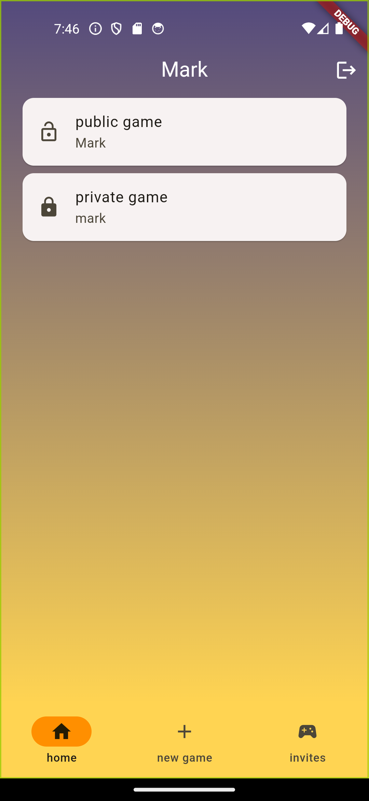
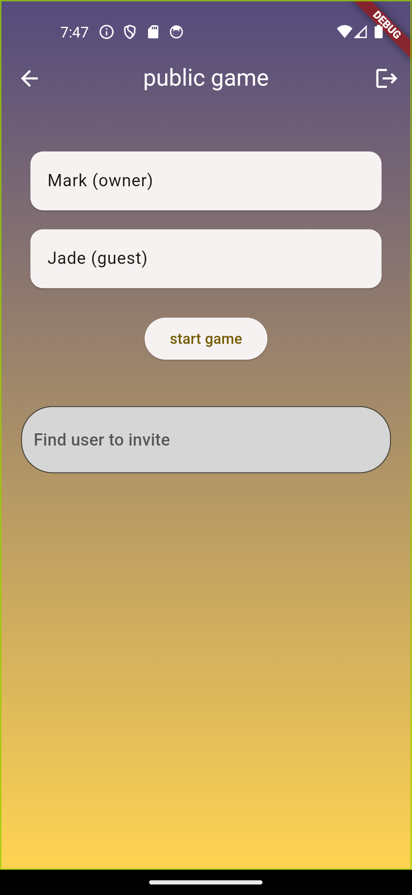
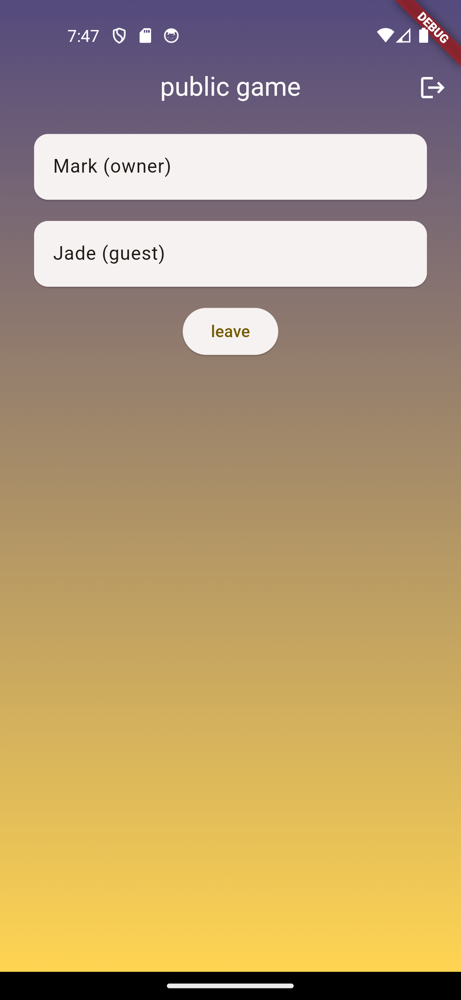
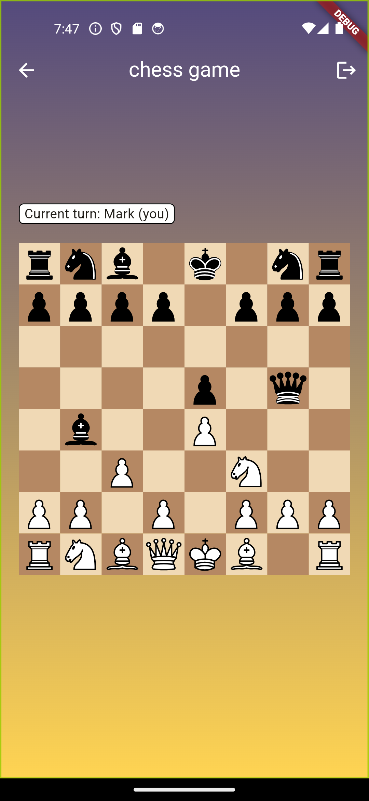
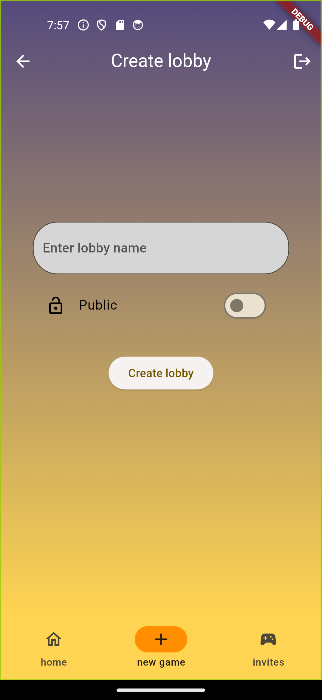

# flutter-chess

Chess is the app that allows users to create public/private lobbies and play chess with each other. As this is a school project, I've included the video of the audit process that showcases main features of the app: https://www.youtube.com/watch?v=d9wRt4dx4Is

## Features

- Invite users to lobbies
- Create private and public lobbies
- Join public games
- Only invited user can join private lobby

# Technologies

- Real time database - [Firebase](https://firebase.google.com/)
- Chess engine - https://pub.dev/packages/chess
- Chess board - https://pub.dev/packages/simple_chess_board
- State management with Provider pattern

# Run project locally

- Proceed to the official guide for flutter "Get started" https://docs.flutter.dev/get-started/install
- Clone this repo to your machine
- Run **flutter pub get**
- Run **main.dart** file with debugger (ctrl+F5 in VSCode)
- Enjoy the app (or don't enjoy)

# Screenshots

